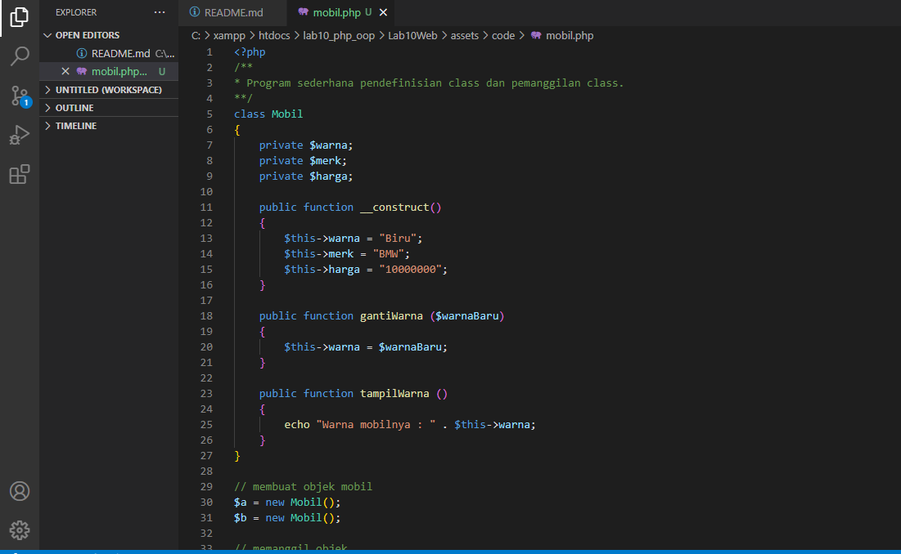
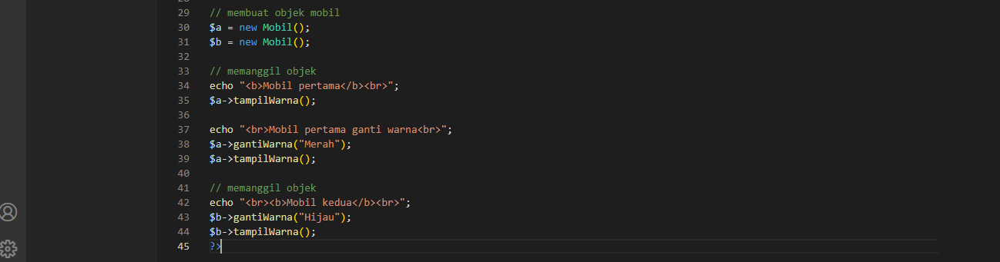
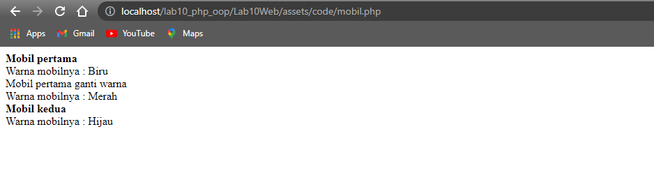
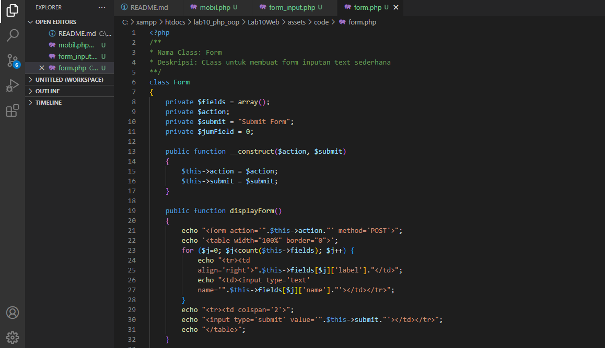
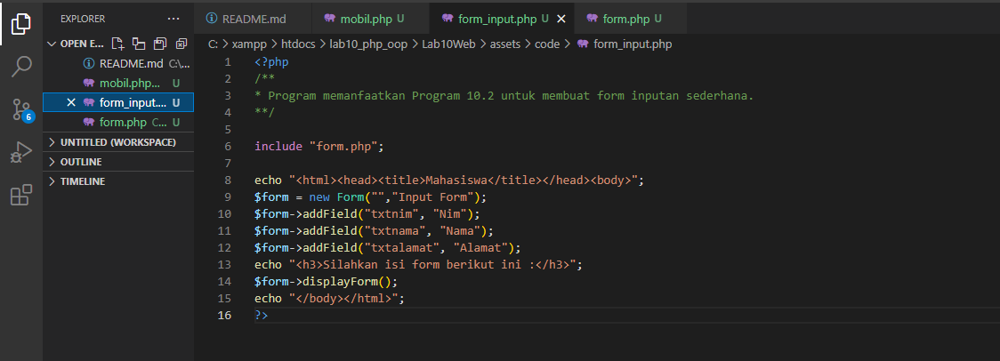
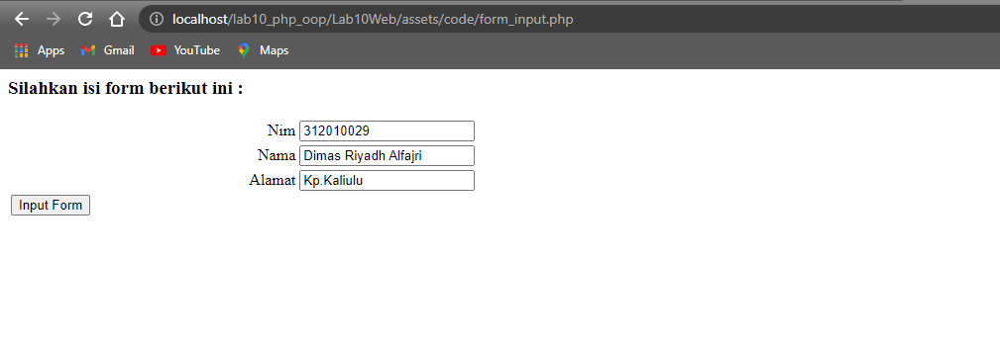

| Nama      | Aditya Bani Isro |
| ----------- | ----------- |
| NIM     | 312010134       |
| Kelas   | TI.20.A.1        |

## Langkah langkah Praktikum 10

### 1. Buat file baru dengan nama mobil.php
- Kode nya ada di screenshot an VSCode dibawah ini :

### Output :

### 2. Buat file baru dengan nama form.php

### 3. Buat file baru dengan nama form_input.php

### Output :

